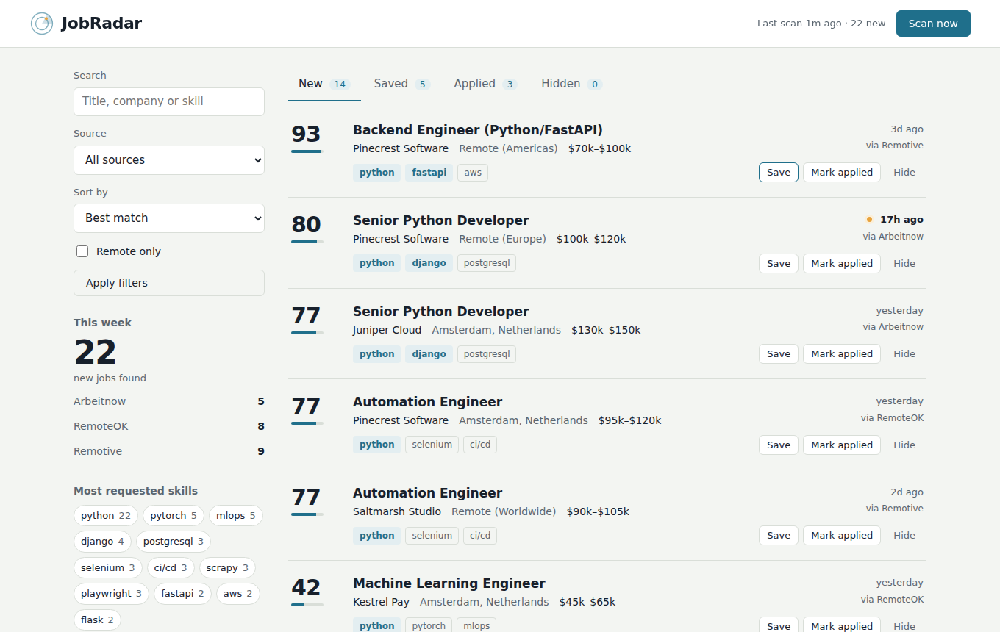
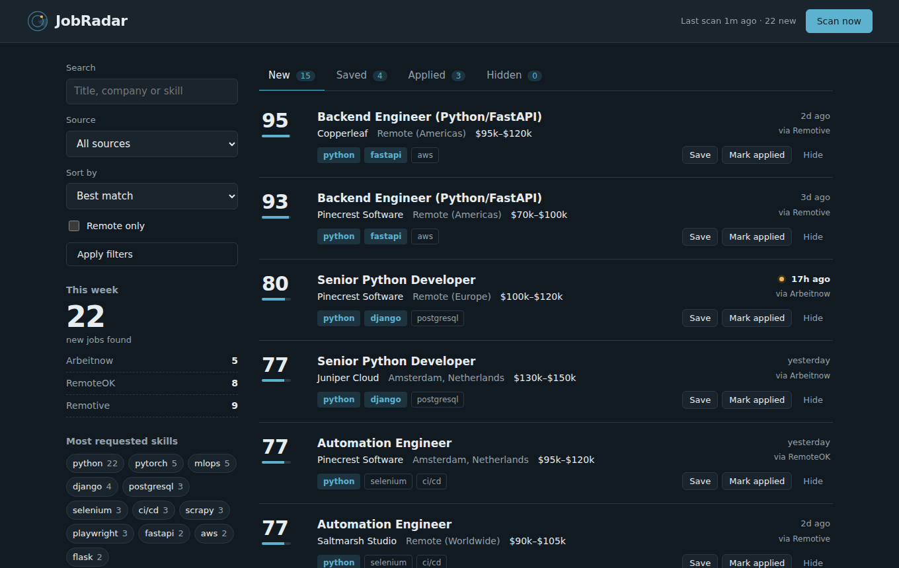
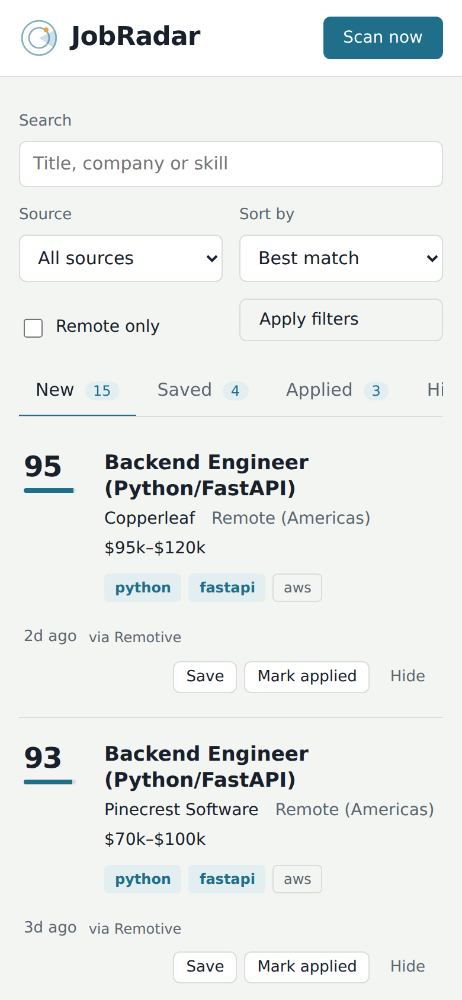
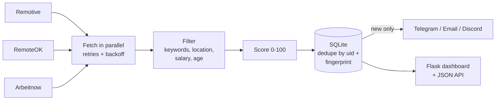

# JobRadar

[](https://github.com/muhammad-zeeshan-4854/jobradar/actions/workflows/ci.yml)


**JobRadar watches job boards for you.** It pulls listings from several sites, drops the ones that don't fit, scores the rest against your skills, and sends only *new* matches to Telegram, email or Discord. A small web dashboard lets you sort through them and track what you've applied to.



## Why I built this

Checking five job sites every morning is slow, and most listings are irrelevant or duplicates of each other. I wanted one place that shows me only roles that match my stack, ranked by how good a fit they are, and pings me the moment a new one appears.

## Features

- **Multiple sources, one feed.** Remotive, RemoteOK and Arbeitnow out of the box, fetched in parallel. Adding a new site is a single class (see [Adding a source](#adding-a-source)).
- **Relevance scoring (0-100).** Keywords found in the title count more than in tags, which count more than in the description. Fresh posts and listings with a salary get a bonus.
- **Smart filtering.** Include/exclude keywords with proper word boundaries (`java` won't match `javascript`, `c++` and `node.js` work), location, remote-only, minimum salary, max age and a company blocklist.
- **Cross-site deduplication.** The same role posted on two boards is detected by a normalised title+company fingerprint and shown once.
- **Alerts without repeats.** Telegram, HTML email digest and Discord webhooks. Long batches are split to respect each platform's limits. A job is only alerted once, ever.
- **Application tracker dashboard.** Filter, search and sort; move jobs between *New, Saved, Applied, Hidden*; trigger a scan from the browser. Light and dark mode, works on mobile.
- **Runs anywhere.** CLI, Docker Compose, or completely free on a GitHub Actions schedule.
- **Resilient.** HTTP retries with backoff and `Retry-After` support, per-source error isolation (one site going down never kills a run), and every run is logged to the database.
- **Tested.** 40+ pytest tests with no network access needed, linted with Ruff, CI on Python 3.10-3.12.

| Dark mode | Mobile |
|---|---|
|  |  |

## Quick start

```bash
git clone https://github.com/muhammad-zeeshan-4854/jobradar.git
cd jobradar
python -m venv .venv && source .venv/bin/activate   # Windows: .venv\Scripts\activate
pip install -e ".[dev]"

jobradar init          # creates config.yaml and .env
jobradar demo          # optional: load sample jobs to explore the UI
jobradar serve         # open http://127.0.0.1:8000
```

Then edit the `keywords` in `config.yaml` and run a real scan:

```bash
jobradar run
```

## Commands

| Command | What it does |
|---|---|
| `jobradar init` | Create `config.yaml` (and `.env`) from the examples |
| `jobradar run` | Run one scan; add `--no-alerts` to only store results |
| `jobradar watch` | Keep scanning every `interval_minutes` |
| `jobradar serve` | Start the dashboard (`--host`, `--port`) |
| `jobradar list` | Show stored jobs in the terminal (`-s python`, `--status saved`, `--sort salary`) |
| `jobradar export` | Export to CSV or JSON (`-f json -o jobs.json`) |
| `jobradar stats` | Print counts by status, source and top skills |
| `jobradar test-notify` | Send a test alert to every enabled channel |
| `jobradar demo` | Load fictional sample data |

## Configuration

Everything lives in `config.yaml`. Secrets are referenced as `${ENV_VAR}` and loaded from `.env`, so the config file is safe to commit.

```yaml
filters:
  keywords: [python, django, fastapi]
  exclude_keywords: [php, wordpress]
  remote_only: true
  min_salary: 40000
  max_age_days: 14
  min_score: 20

notifiers:
  telegram:
    enabled: true
    bot_token: ${TELEGRAM_BOT_TOKEN}
    chat_id: ${TELEGRAM_CHAT_ID}
```

<details>
<summary><b>Setting up Telegram alerts</b></summary>

1. Message [@BotFather](https://t.me/BotFather), send `/newbot`, and copy the token.
2. Send any message to your new bot.
3. Open `https://api.telegram.org/bot<TOKEN>/getUpdates` and copy `chat.id`.
4. Put both in `.env`, set `enabled: true`, then run `jobradar test-notify`.
</details>

<details>
<summary><b>Setting up email alerts (Gmail)</b></summary>

Turn on 2-step verification, create an [App Password](https://myaccount.google.com/apppasswords), and use it as `SMTP_PASSWORD`. Your normal password will not work.
</details>

## Run it free on GitHub Actions

`.github/workflows/scheduled-scan.yml` runs a scan every 6 hours on GitHub's servers. The seen-jobs database is carried between runs with the Actions cache, so you never get the same alert twice.

1. Fork or push this repo.
2. Go to **Settings → Secrets and variables → Actions** and add `TELEGRAM_BOT_TOKEN` and `TELEGRAM_CHAT_ID` (or the Discord/email secrets).
3. Open the **Actions** tab and run *Scheduled job scan* once to test it.

## Deploy a live demo (Render)

1. Create a free account on [Render](https://render.com) and choose **New → Web Service**, then connect this repository.
2. Use these settings:
   - **Build command:** `pip install -r requirements.txt`
   - **Start command:** `gunicorn jobradar.wsgi:app`
   - **Environment variable:** `JOBRADAR_DEMO` = `1` (loads sample jobs on first start)
3. Deploy. The dashboard is served at your `onrender.com` address, and **Scan now** fetches real jobs.

On free hosting the disk is reset on each deploy and the service sleeps when idle, so the first visit after a while can take a little longer to load.

## Run with Docker

```bash
cp config.example.yaml config.yaml && cp .env.example .env
docker compose up -d       # dashboard on :8000 plus a background watcher
```

## How it works



### Scoring

For each keyword: **+30** if it is in the title, otherwise **+15** in tags, otherwise **+5** in the description. Two strong title matches already give the full 75 points for relevance. On top of that, a job gets up to **+15** for being fresh (fading out over 7 days) and **+10** if it lists a salary. The total is capped at 100.

### Project structure

```
jobradar/
├── sources/        # one adapter per job site + registry
├── notifiers/      # telegram, email, discord
├── web/            # Flask app, template, CSS
├── filters.py      # hard filters + scoring
├── storage.py      # SQLite: jobs, statuses, run history
├── pipeline.py     # fetch → filter → store → notify
├── config.py       # YAML + ${ENV} expansion
└── cli.py          # command line interface
tests/              # pytest suite, fully offline
```

### JSON API

| Endpoint | Description |
|---|---|
| `GET /api/jobs?q=&status=&source=&remote=1&sort=&limit=&offset=` | Paginated jobs |
| `GET /api/jobs/<uid>` | One job |
| `POST /api/jobs/<uid>/status` | Body `{"status": "saved"}` |
| `GET /api/stats` | Counts and top skills |
| `GET /api/runs` | Recent scan history |
| `POST /api/scan` | Start a scan in the background |

## Adding a source

```python
# jobradar/sources/mysite.py
from jobradar.models import Job
from jobradar.sources.base import Source, register

@register
class MySiteSource(Source):
    name = "mysite"
    display_name = "My Site"
    homepage = "https://mysite.example"

    def fetch(self, search_terms):
        data = self._get_json("https://mysite.example/api/jobs")
        return [Job(source=self.name, external_id=str(d["id"]), title=d["title"],
                    company=d["company"], url=d["url"]) for d in data]
```

Import it in `jobradar/sources/__init__.py`, add `mysite: {}` under `sources` in your config, and write a test with `FakeSession`.

## Development

```bash
make test    # pytest with coverage
make lint    # ruff
```

## Responsible use

JobRadar uses each site's **official public API** rather than scraping HTML, sends a descriptive User-Agent, enforces a minimum interval of 10 minutes between scans, and always links back to the original listing. Please keep it that way if you add sources, and check each site's terms first.

## Roadmap

- [ ] More sources (Greenhouse and Lever company boards)
- [ ] Per-user keyword profiles
- [ ] Weekly summary email with trends

## License

MIT
